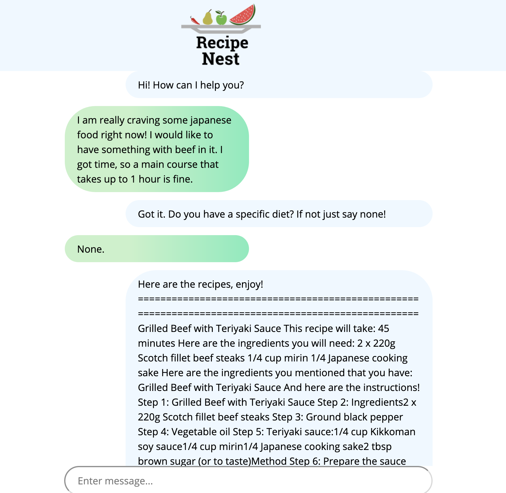
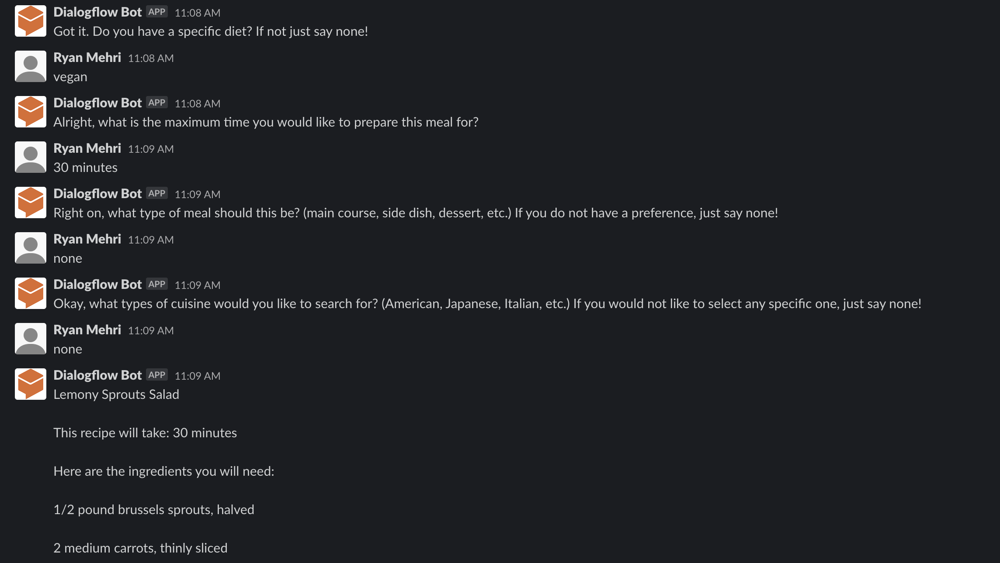
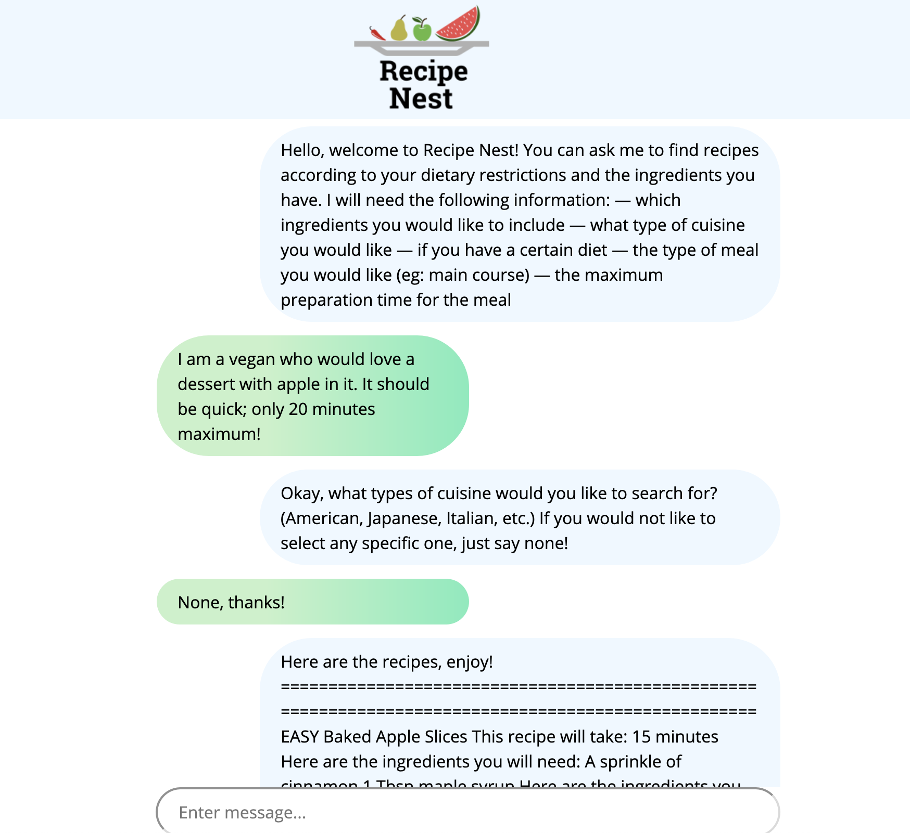

# Recipe Finder - Project for NWHacks 2020

## The Problem

About 1/3 of food produced in the world is lost or wasted in the year. There are many reasons for this, including not being able to cook with said food, not having time to cook this food or cooking food that does not taste good. Albeit this, food waste is a serious problem that wastes money, wastes time and harms the environment.

## Our Solution

Our web app, Recipe Nest is a chat bot deployed on Slack, the Web, through calls. (Messenger and Google Assistant are currently awaiting approval). Users simply enter in all the filters they would like their recipe to contain and Recipe Nest finds a recipe conforming to the users' requests! We believe that making this application as accessible as possible reflects our goal of making it easy to get started with cooking at home and not wasting food!

## How we did it

We used Python, Flask, for the backend. Our chat bot was built with Google Cloud's Dialogflow in which we personally trained to be able to take user input. The front end was built with CSS, HTML, and Bootstrap.

## Going forward

We hope to add user logins via Firebase. We would then add features such as 1. Saving food in your fridge 2. Having the app remind you of this food 3. Allow the user to save recipes that they like. Additionally, we would like to add more filters, such as nutrition, cost, and excluding certain foods, and finally, create a better UI/UX experience for the user.

## Examples

